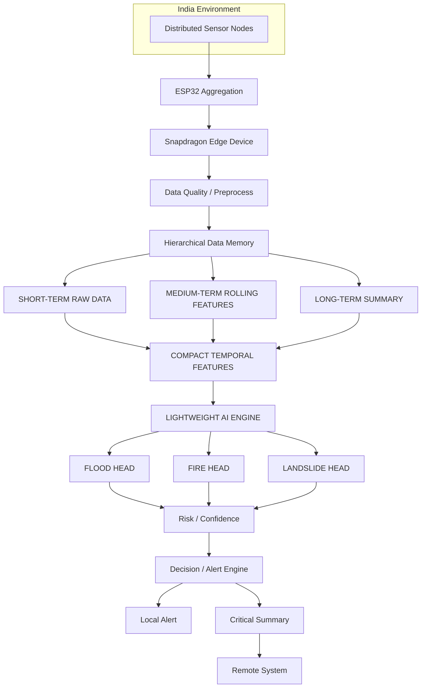

# system_architecture.md

## System Architecture Overview

**Current proof‑of‑work** focuses on the **Flood dataset → Flood head** path (highlighted in the diagram). The **Fire** and **Landslide** heads, as well as the downstream alert engines, are part of the planned future expansion and are not yet implemented.

### Key Design Elements

- **Hierarchical Temporal Memory** – short, medium, long‑term tiers reduce data volume for edge inference.
- **Shared Lightweight Encoder** – learns a common representation for all hazards.
- **Hazard‑Specific Heads** – enable modular addition of new models (fire, landslide, pollution).
- **Edge‑First Deployment** – all processing up to the encoder runs on the Snapdragon device, minimizing reliance on cloud resources.

*The diagram is generated using Mermaid syntax for easy rendering in GitHub markdown.*
